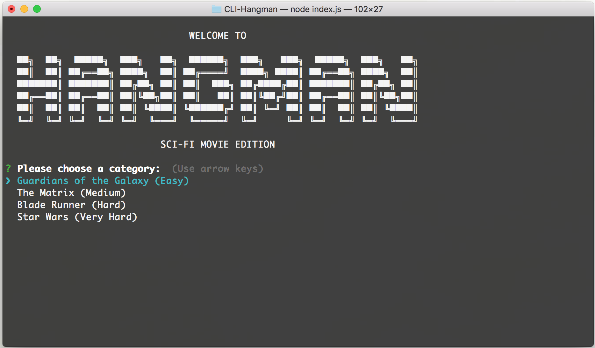
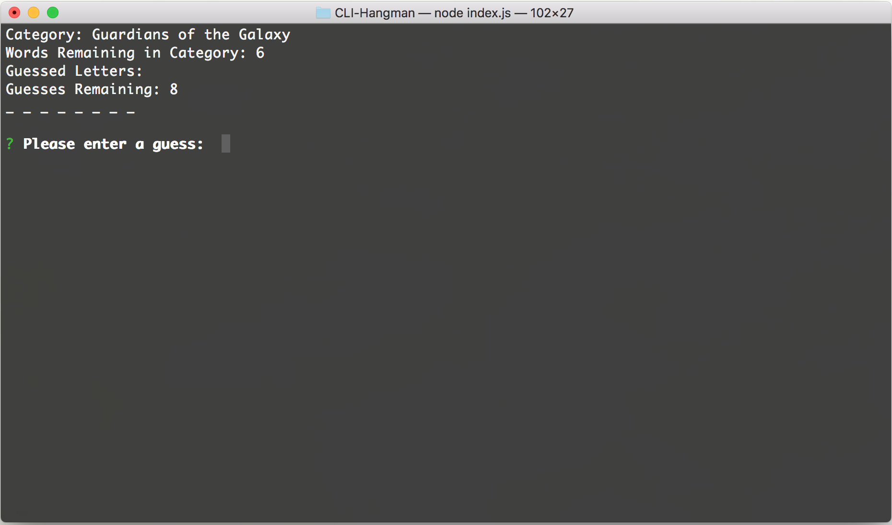
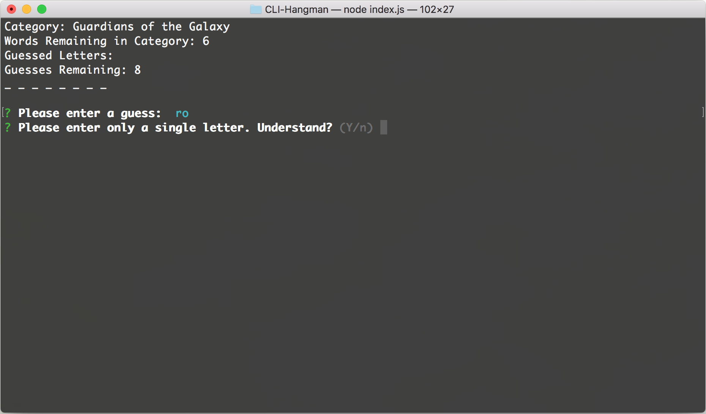
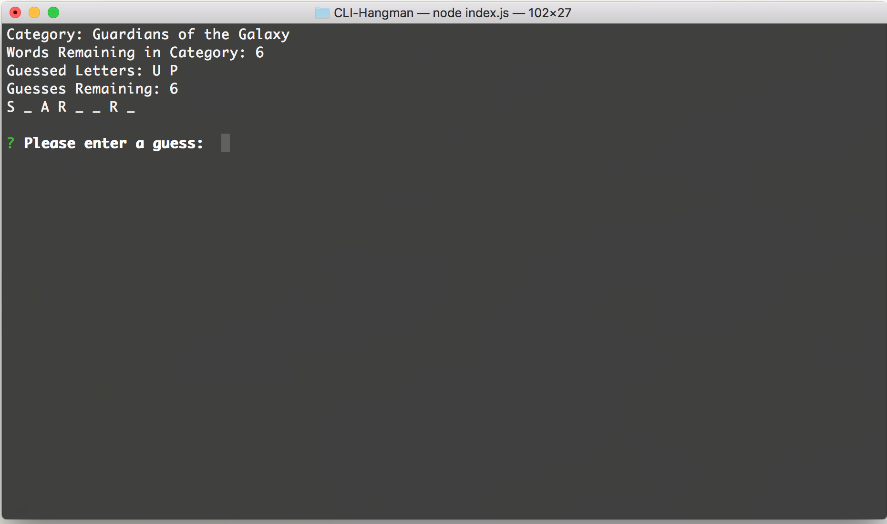
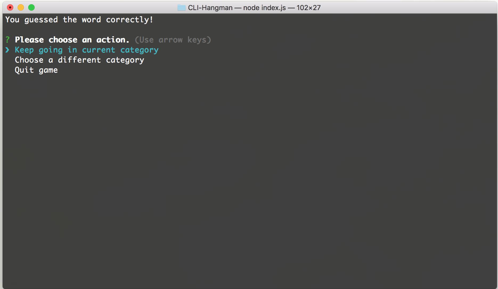
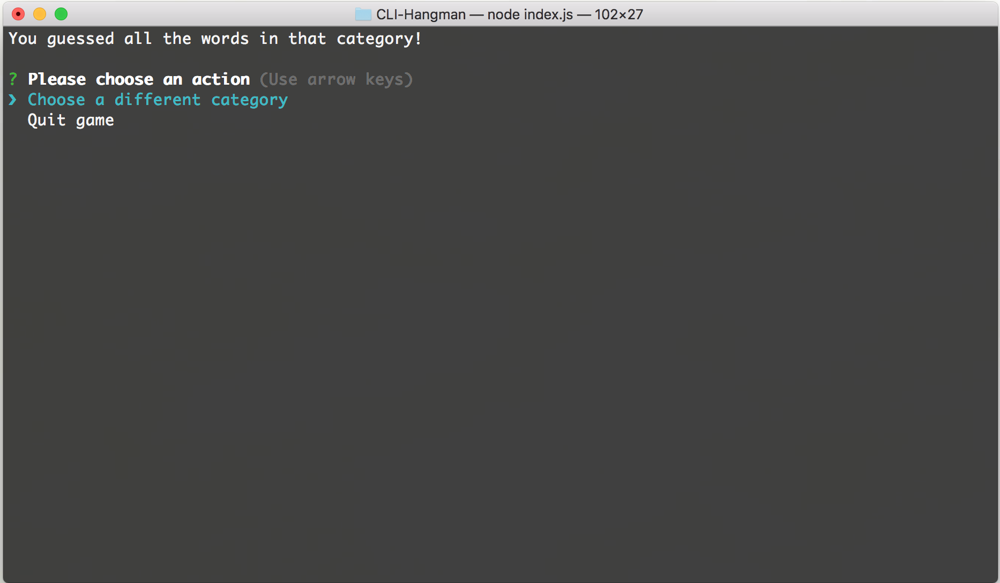
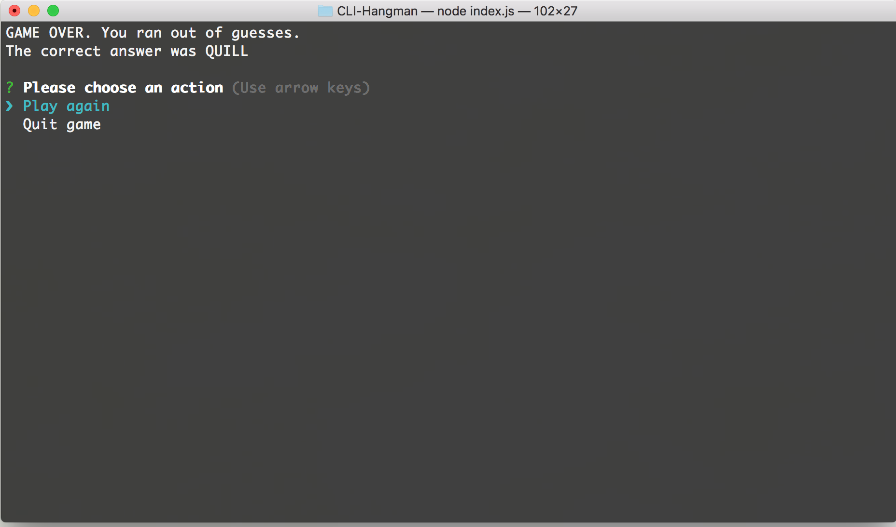

# CLI-Hangman
A Command Line Interface Hangman Game

## Description

Command Line Interface Hangman (CLI-Hangman) is a simple Node.js game with a science-fiction movie theme.  The user is allowed to choose from one of four categories, with difficulties ranging from easy to very hard.

## Installation

CLI-Hangman utilizes Node Package Manager (NPM) to install features.  The user will need to install a number of packages in order to play.

### Clone CLI-Hangman Repository

In the console, navigate to the directory where you wish to install CLI-Hangman.  Type ```git clone https://github.com/awyand/CLI-Hangman.git``` to clone the CLI-Hangman repository.  This will create a local copy of CLI-Hangman files on your system.

### Packages

All dependencies are tracked in the provided package.json and package-lock.json files.  In the console, navigate into the cloned directory ("CLI-Hangman") and type ```npm install```  This will install the following NPM packages:

* [Clear](https://www.npmjs.com/package/clear)
* [Inquirer](https://www.npmjs.com/package/inquirer)

### Files

CLI-Hangman utilizes three core files for functionality:
* index.js: This file manages the game's progression logic and imports Word object creation functionality from Word.js.
* Word.js: This file contains a Word object constructor, which imports Letter object functionality from Letter.js.  The Word object constructor accepts a word as a string and creates an array of Letter objects using Letter.js.  It also includes two methods, one for creating an output string based on if a particular letter has been guessed or not, and one for running a user input against the letter array to see if a guessed letter is within the current word.
* Letter.js: This file contains a Letter object constructor, which accepts a letter as a string and a boolean for if the letter has been guessed or not.  It also includes two methods.  The first method returns a letter if the letter has been guessed or an underscore if the letter has not been guessed.  The second method checks a user guessed letter against the letter object and changes the guessed boolean to true if it's a match.

## User Guide

Once CLI-Hangman is installed, it's time to start playing.  Upon launching the game, the user is presented with the following welcome screen and is prompted to choose from one of the four categories:



Once a category is selected, the user is presented with basic game information:
* Category Name
* Words Remaining in Category
* Guessed Letters
* Guesses Remaining

The user is also presented with a game board, initially filled with underscores representing each letter in the current word, and a prompt "Please enter a guess: ".



This prompt accepts exactly one letter and will present the user with an invalid input message if they enter more than one character or a non-letter character:



This prompt requires the user to acknowledge that they understand the input rules and will only continue the game if they answer "Y" (yes/true).

As the user enters letters, the game board will update accordingly.  If the guessed letter is in the current word and hasn't been guessed yet, it will be presented on the game board.  If the guessed letter is NOT in the current word and has NOT already been guessed, it will be added to the Guessed Letters list and Guesses Remaining will be reduced by 1.  If the guessed letter is NOT in the current word but HAS been guessed already, the user will not be penalized.



If the user guesses an entire word correctly, they will be presented with the following options:



If the user chooses to continue in the current category, a different word will be chosen from the current category, and this will continue until there are no words remaining in the category.  If the user correctly guesses all words in a category, they will be presented with the following options:



In any situation, if the user chooses a different category, all categories will reset to their original states, meaning that the user must guess all words in a category again to make it to the end.

If the user runs out of guesses on a word, they will be presented with the correct answer and given the following options:


